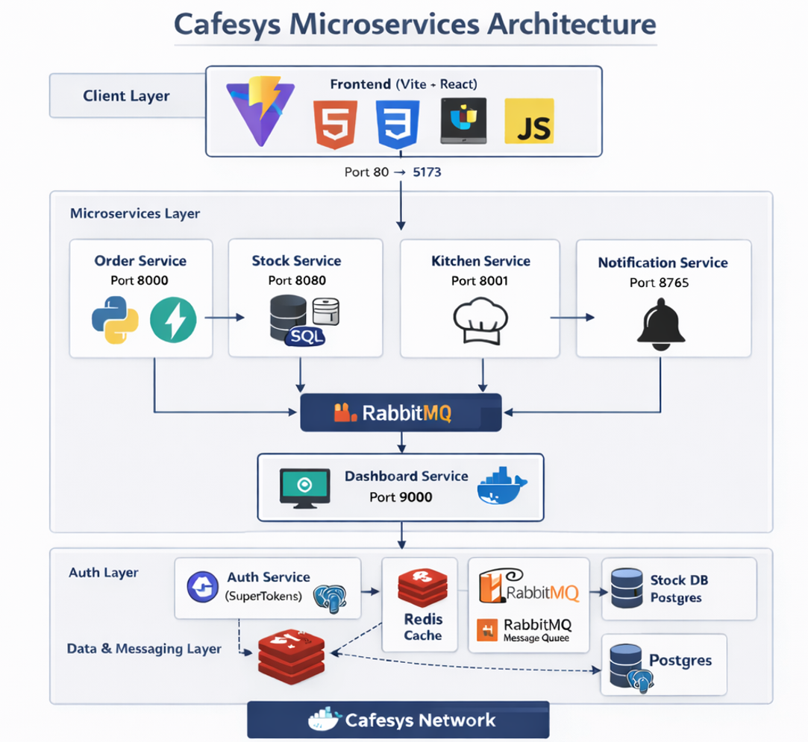

# CafeSys

CafeSys is a microservice-based cafeteria ordering system with real-time order status updates.
It includes a React frontend, Python backend services, Redis and PostgreSQL data stores, RabbitMQ messaging, and a FastAPI health dashboard.

## Architecture Diagram



## Tech Stack

- **Frontend:** React 19 + TypeScript + Vite (`services/frontend`)
- **Auth:** SuperTokens core + `supertokens-python` / `supertokens-auth-react`
- **Backend services:** Python (Flask / FastAPI / aiohttp / websockets)
- **Messaging:** RabbitMQ (order and status event queues)
- **Caching:** Redis
- **Databases:** PostgreSQL (auth + stock)
- **Container orchestration:** Docker Compose

## Repository Structure

```text
.
├─ docker-compose.yml
├─ services/
│  ├─ frontend/       # UI for users/admin, auth integration
│  ├─ order/          # Authenticated order API
│  ├─ stock/          # Inventory + order persistence + queue publisher/consumer
│  ├─ kitchen/        # Simulates kitchen workflow and emits status updates
│  ├─ notification/   # WebSocket push service for per-user updates
│  └─ dashboard/      # Health/status dashboard with chaos controls
└─ web/               # Optional misc web assets (if present)
```

## Service Responsibilities

### Frontend (`services/frontend`)

- Routes:
  - `/` home
  - `/order` place order + live status (requires session)
  - `/admin` stock management
  - `/auth` SuperTokens UI
- API clients:
  - Order API: `POST /order`
  - Stock API: `GET /status`, `POST /setstock`
- WebSocket:
  - Connects via `/ws-notify` (proxied in Vite) to notification service.

### Order Service (`services/order`, port `8000`)

- Flask + SuperTokens middleware
- Endpoints:
  - `GET /health`
  - `POST /order` (session protected)
- Validates stock from Redis cache and forwards order request to stock service.

### Stock Service (`services/stock`, port `8080`)

- Flask + SQLAlchemy + PostgreSQL + Redis + RabbitMQ
- Endpoints:
  - `GET /health`
  - `GET /status` (returns stock)
  - `POST /setstock` (admin stock set)
  - `POST /order` (decrement stock, persist order, publish to `order_queue`)
- Consumes `status_queue` to update order lifecycle in DB.

### Kitchen Service (`services/kitchen`, port `8001`)

- Consumes `order_queue`
- Simulates order lifecycle transitions:
  - `received` → `cooking` → `packaging` → `ready`
- Publishes each transition to:
  - `status_queue`
  - `notification_queue`
- Health endpoint: `GET /health`

### Notification Service (`services/notification`, ports `8765` + `8766`)

- WebSocket server on `8765`
- Health endpoint on `8766` (`GET /health`)
- Consumes `notification_queue` and pushes updates to connected user-specific WebSocket clients.

### Dashboard Service (`services/dashboard`, port `9000`)

- FastAPI app for service health and operational controls
- Polls `/health` endpoints of core services
- Exposes API:
  - `GET /api/status`
  - `POST /api/chaos/{service}`
  - `POST /api/chaos/{service}/restore`
- Uses Docker socket to stop/start containers for chaos testing.

## Default Ports

| Component           |                           Port | Notes                         |
| ------------------- | -----------------------------: | ----------------------------- |
| Frontend (Vite)     |        `80` → container `5173` | App entry point               |
| Order API           |                         `8000` | SuperTokens API base: `/auth` |
| Stock API           |                         `8080` | Inventory + orders            |
| Kitchen             |                         `8001` | Health endpoint               |
| Notification WS     |                         `8765` | WebSocket updates             |
| Notification health |                         `8766` | Dashboard health checks       |
| Dashboard           |                         `9000` | Ops dashboard                 |
| RabbitMQ AMQP       |                         `5672` | Queue transport               |
| RabbitMQ UI         |                        `15672` | Admin console                 |
| Redis               |                         `6379` | Cache                         |
| Auth DB (Postgres)  | `5433` host → `5432` container | SuperTokens DB                |
| Stock DB (Postgres) | `5434` host → `5432` container | Stock service DB              |
| SuperTokens core    |                         `3567` | Auth engine                   |

## Event Flow

1. User signs in (SuperTokens) and places order from frontend.
2. Order service validates session and forwards request to stock service.
3. Stock service checks/decrements stock, stores order, publishes message to `order_queue`.
4. Kitchen service consumes order, emits status events through processing stages.
5. Notification service sends real-time updates to the matching user via WebSocket.
6. Dashboard polls health endpoints and can stop/start services for chaos testing.

## Quick Start (Docker Compose)

### Prerequisites

- Docker + Docker Compose

### Run

From repository root:

```bash
docker compose up --build
```

Then open:

- Frontend: `http://localhost`
- Dashboard: `http://localhost:9000`
- RabbitMQ UI: `http://localhost:15672`

### Stop

```bash
docker compose down
```

To remove volumes too:

```bash
docker compose down -v
```

## Local Frontend Development

For local frontend without full containerized frontend runtime:

1. In `services/frontend`, copy `.env.example` to `.env` and adjust values if needed.
2. Install dependencies and start Vite:

```bash
cd services/frontend
npm install
npm run dev
```

Suggested API env values:

- `VITE_API_URL=http://localhost:8000/`
- `VITE_STOCK_API_URL=http://localhost:8080/`

## Health Checks

- `http://localhost:8000/health` (order)
- `http://localhost:8080/health` (stock)
- `http://localhost:8001/health` (kitchen)
- `http://localhost:8766/health` (notification)
- Dashboard aggregate status: `http://localhost:9000/api/status`

## Notes

- `services/order/routes/metrics.py` exists but is currently empty.
- Dashboard chaos controls require Docker socket access (`/var/run/docker.sock`, configured in compose).
- This repository is set up for container-first execution; running all Python services directly requires manual dependency/env setup per service.
